## Product Introduction


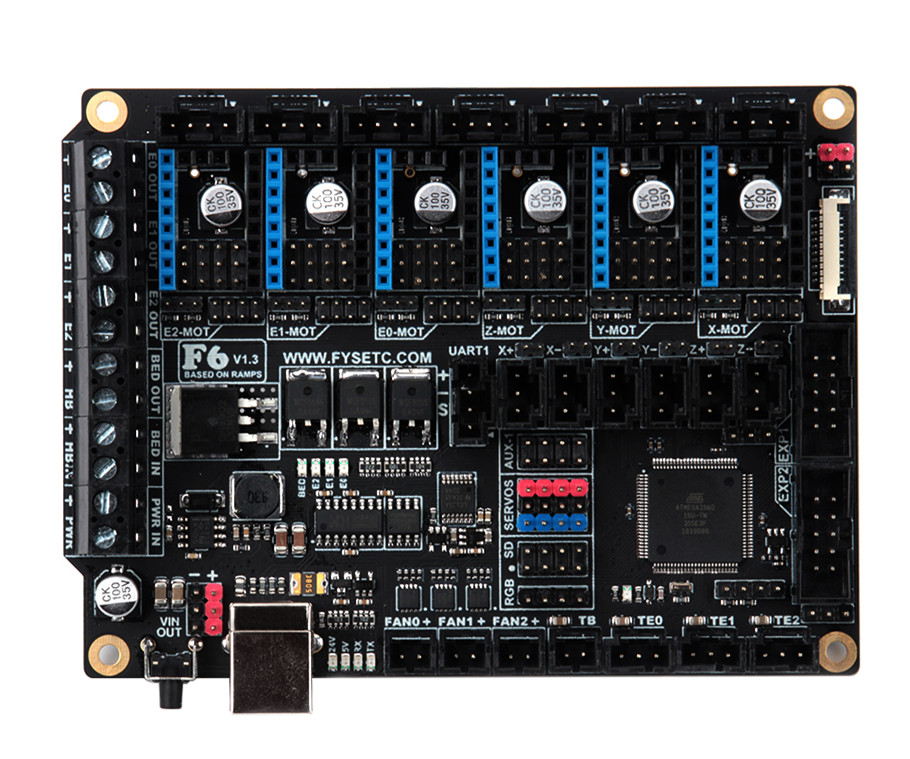

The FYSETC F6 board is a feature rich all-in-one electronics solution for 3D printer and other CNC devices.  It provides six drivers slots and supports Pololu pin compatible stepper drivers, especially the TMC drivers modules. There is no need for flying wires when using TMC2100, TMC2130 and TMC2208. and SPI,Usart and ther pin configer functions are available.

## Features

- Compact size: 117mm x 87mm
- fully integrated all in one solution:
  - Arduino 2560-R3 compatible (works with Sprinter, Repetier-Firmware, Marlin out of the box)
  - CH340 for high speed USB serial connection 
- UNIVERSAL POWER:
  - can be used with 9V-28V for motors / heated bed
  - integrated high precision power regulators (DC/DC):  5V 3A Max 
  - power input auto selector for ATmega/logic (stand alone or power from USB)
- Easy DISPLAY + SD-CARD connector:
  - RepRapDiscount SmartController compatible pin header on board
  - **10P FPC for Serial Touch display**
  - 2X4 PinHeader Out for SD Card moudle 
- **Up to 6 motor drivers with easy micro-steps setup and Supports TMC driver without flying wire**
- 10x PWM capable power mosfet outputs (1 for HotBed, 3 for Heat-End, 3 for fans, 3 for RGB LED strip) 
- The Hot-Bed is designed as a separate power input for maximum current
- All unused pins are led out by pin headers
- <font color=#0099ff size=3 face="~~On Board External 2Mb SPI Flash~~">~~On Board External 2Mb SPI Flash~~</font> 
- PCB：
  - 4 layer
  - 2OZ copper inner layers，1OZ out layers
  - High quality, High temperature FR4-TG130 PCB
  - Gold ENIG finishing

## Application

- 3D printer 
- CNC Device
- Other similar machines

## Hardware Reasources

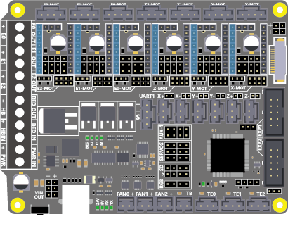

| Board Name           | F6                                            |
| -------------------- | --------------------------------------------- |
| License              | GPL V2.0                                      |
| Latest Version       | V1.3                                          |
| Extruders            | 3                                             |
| Fixed Fans           | 5 Max                                         |
| Controlled Fans      | 3 Max                                         |
| Heaters              | 3 Max                                         |
| Endstops             | 6 Max                                         |
| Temp sens            | 4 Max                                         |
| SPI                  | 1                                             |
| I2C                  | 1                                             |
| ISP                  | 1                                             |
| Serial port chip     | CH340                                         |
| CPU                  | Atmega2560                                    |
| CPU Speed ( MHz )    | 16 Mhz                                        |
| Stepper driver       | 6 Max                                         |
| Stepper driver  Type | All StepStick compatible modules              |
| Input                | Main PWR：12-24V 10A Max；BED IN：12-24V 15A Max |
| Output               | BED OUT：15A Max ；Heater Out：5A Max            |

## Jumper for different drivers

In order to support as many different drivers as possible, F6 sets a lot of jumper positions. Different drive modules require different jumpers. The following is a detailed description:

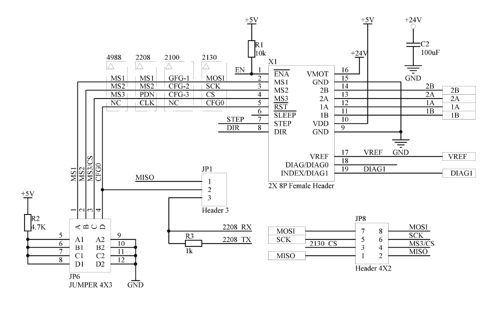

As shown in the schematic diagram above, there are three sets of jumpers in the drive section: JP1, JP6, and JP8. The different driver correspondences are shown in the following table:

| Divers Class                 | Used jumpers                    |
|:----------------------------:|:-------------------------------:|
| A4988/DRV8825/THB6128/LV8729 | JP6（only ABC ways）              |
| TMC2100                      | JP6（only AB ways）               |
| TMC2208                      | JP1（Short 2&3）&  JP6            |
| TMC2130                      | JP1（Short 1&2）&  JP8（Short All） |

#### 1- A4988 and similar series

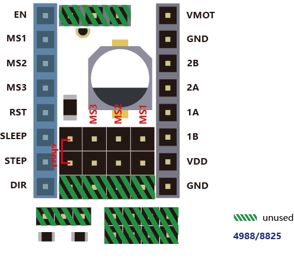

If you use the normal A4988 series module, you only need to set the jumper according to the position shown in the figure above, and you should not insert any jumpers in the shaded green part.

#### 2-TMC2100

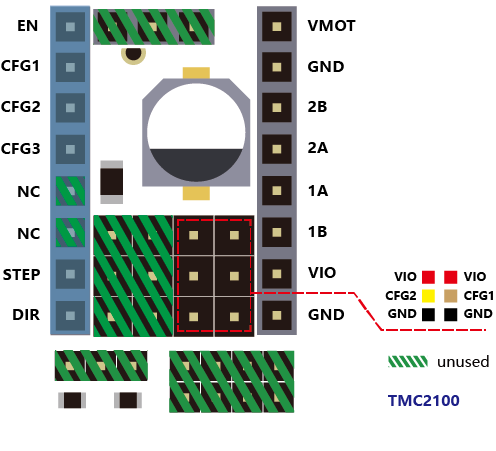 

If you use the TMC2100 module and want to change its microsteps and mode settings, first you must ensure that the CFG1 and CFG2 of the 2100 module are connected by a pin next to it. (For the FYSETC version, you can only perform the welding configuration on the board. The default CFG1 And CFG2 is not connected to the pin header, and the connected version will be sold later)

#### 3-TMC2208

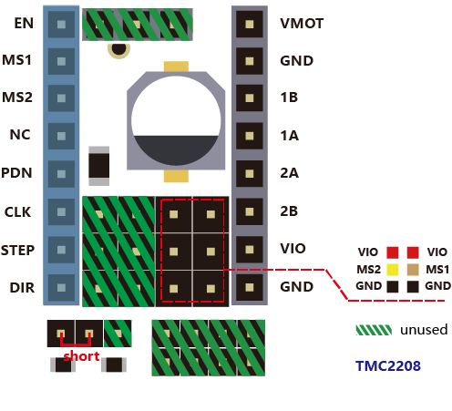

If you use the TMC2208, there are two modes to choose . FYSETC's 2208 is factory defaulted to standalone mode. At this mode, you can only set the microsteps by MS1 and MS2.
If you want to config more , you need to enable PDN. First, You must make the jumper next to the PDN pin closed, and second, make sure that the 2 and 3 pin of the JP1 jumper next to the drive position on F6 board is connected , and then, you can make the configuration of the 2208 with marlin (SoftwareSerial).

#### 4-TMC2130

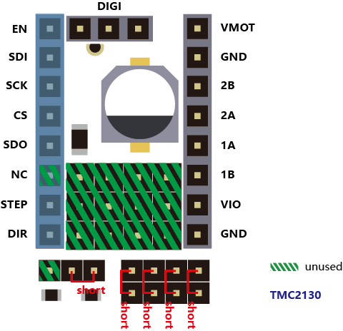

If you use the TMC2130, you should use the SPI mode. FYSETC has a version specifically for F6. The jumper settings on the motherboard are as shown above, and the shaded green part is not used. If you want to use the sensorless endstop function of the 2130, you also need to connect the jumper next to the limit switch socket. The corresponding position of each switch is: X- = X, X+ = E2, Y- = Y, Y+ = E1, Z- = Z, Z+ = E0, then configure the firmware, you can use all the features of the 2130.

## Pin Definition

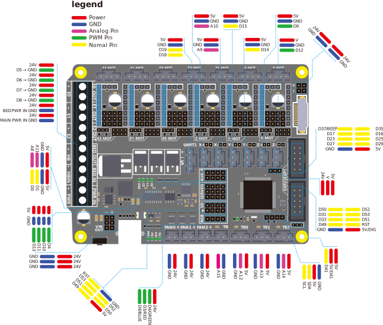

## Firmware Guide

The firmware is in the ```Firmware``` folder.

#### Step1: USB Driver

F6 used a cheap but stable chip for USB to seriel ，CH340，The Driver is here：[https://github.com/FYSETC/CH340-Driver](https://github.com/FYSETC/CH340-Driver)

#### Step2: FYSETC Arduino Plugin

* Instead of manually installing the FYSETC addon's you can now install them from the Arduino Board Manager. From the Arduino File menu select Preferences. 

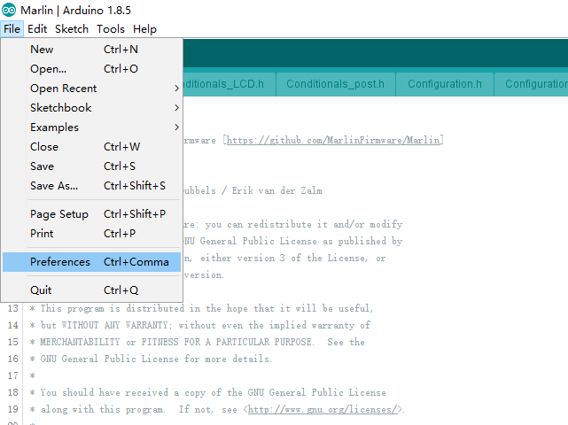

* Add the following URL to "Additional Board Manager URLs" section.
  ​```https://raw.githubusercontent.com/FYSETC/ArduinoAddons/master/package_fysetc_index.json```

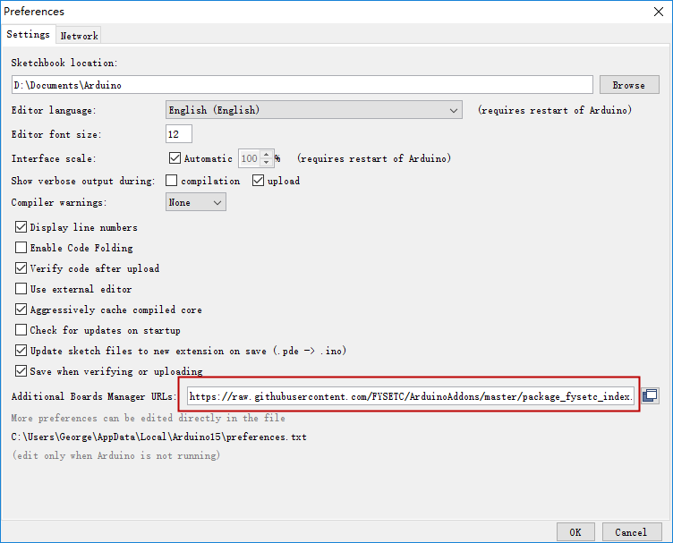

* Open the “Boards Manager”.

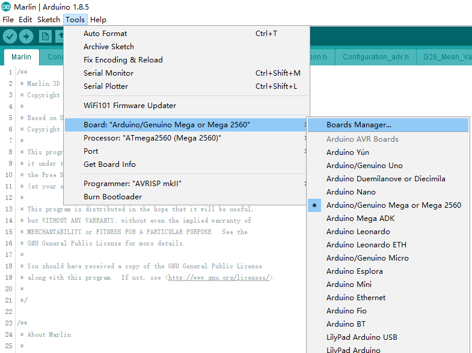

* Search the "FYSETC_F6"

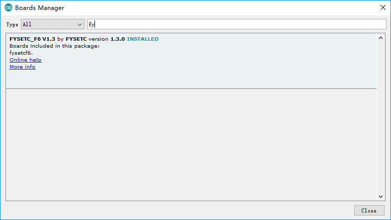

If you want to use F6 V1.4 , you need to update the addon to 1.4.0

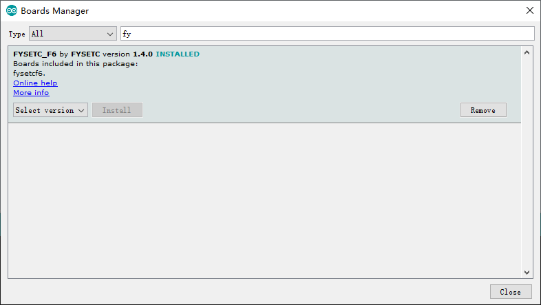

* And then install it.

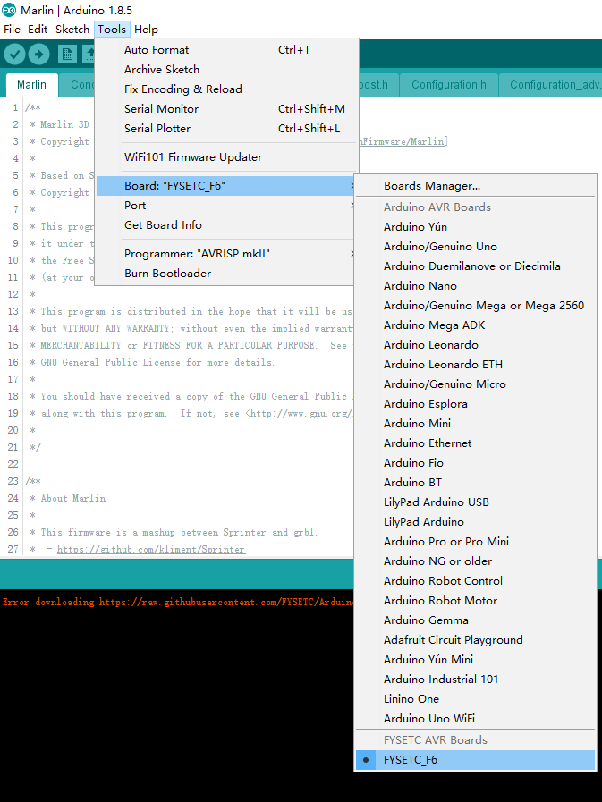

#### Step3: Configure firmware

* Change the board type configuration in configuration.h 
  
  F6 V1.3: BOARD_FYSETC_F6_13
  
  F6 V1.4: BOARD_FYSETC_F6_14

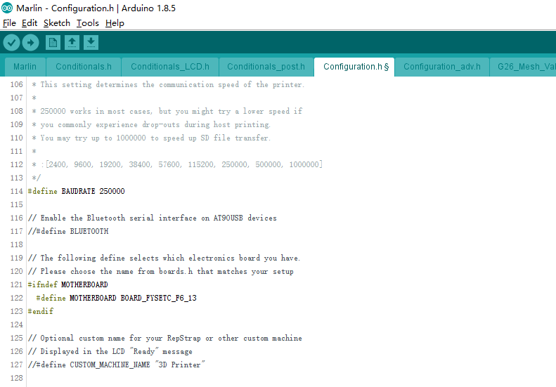

#### Step4: Install TMC2130/TMC2208 library

If you want to use the 1.1.x version frimware ,and you want use TMC2130/TMC2208 driver , you need to install TMC2130/TMC2208 library.

Click "Manage Libraries" .

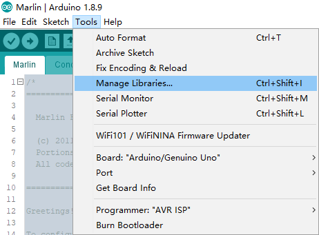

Type "TMC" and Enter to search for TMC2130/TMC2208 library by teemuatlut. Click 'Install' button to install the library.

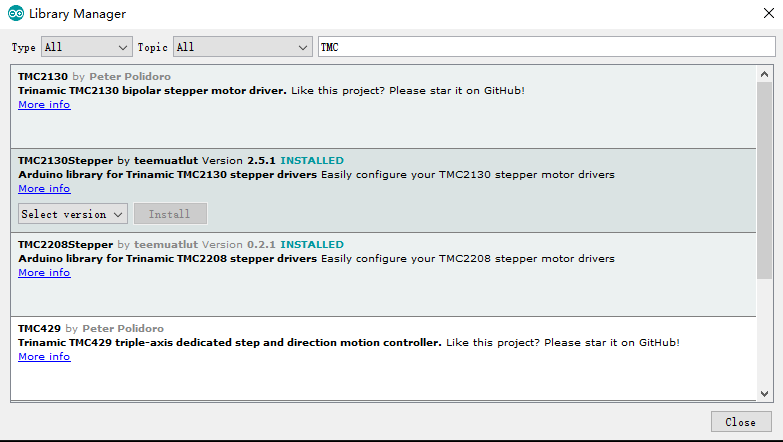

#### Step5: Install TMC library

If you want to use the 2.0.x version frimware , and you want to use TMC stepper drivers , you need to install TMCStepper library.

Click "Manage Libraries" .


Type "TMCStepper" and Enter to search for TMCStepper library by teemuatlut. Click 'Install' button to install the library if you did not install it.

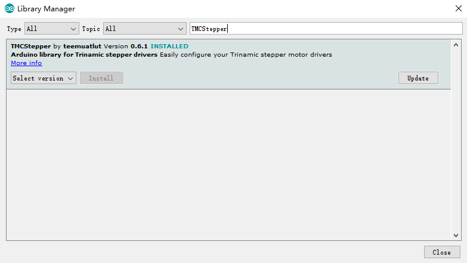

#### Step6: Connect the USB cable

Connect a USB cable between your computer and the machine.Then click Tools->Port and select the COM port.


#### Step7: Upload

Click the arrow button to upload.

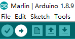

## Platformio

How to build `F6 v1.4`

Replace the file  `C:\Users\*username*\.platformio\packages\framework-arduino-avr\variants\fysetcf6\pins_arduino.h` with the one in the repository.

## Attachments

- [Schematic files](https://github.com/FYSETC/F6/blob/master/F6_V13.pdf)
- [PCB files](https://github.com/FYSETC/F6/blob/master/GERBER_F6_13.zip)

## Shop

- [FYSETC-F6V1.3](https://www.aliexpress.com/item/FYSETC-F6-Board-ALL-in-one-Electronics-Solution-For-3D-Printer-CNC-Devices-Up-to-6/32911155606.html)
- [TMC2100/2130/2208](https://www.aliexpress.com/store/product/5PCS-TMC2100-V1-3-TMC2130-TMC2208-Stepper-Motor-StepStick-Mute-Driver-Silent-Excellent-Stability-Protection-For/3480083_32848553467.html)

## Tech Support

Please submit any technical issue into our [forum](http://forum.fysetc.com/) 
