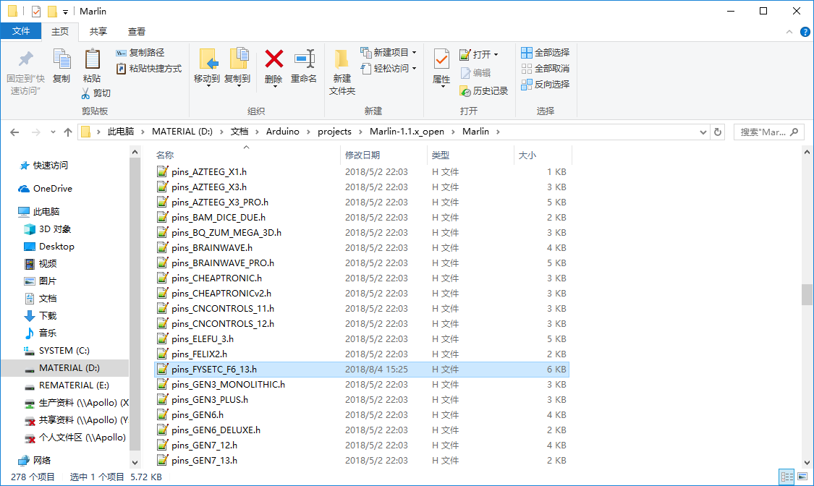
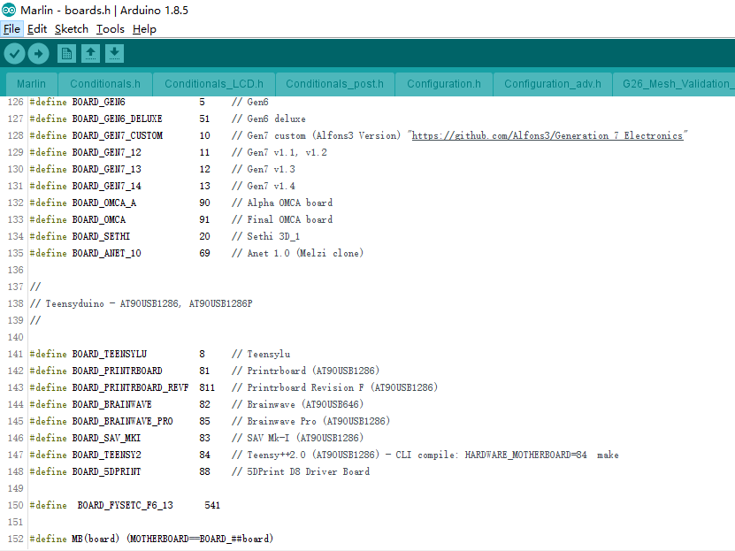
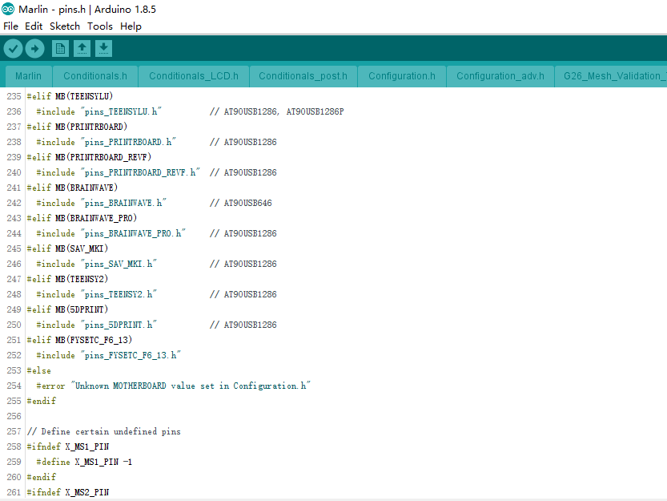

## Product Introduction

---


The FYSETC F6 board is a feature rich all-in-one electronics solution for 3D printer and other CNC devices.  It provides six drivers slots and supports Pololu pin compatible stepper drivers, especially the TMC drivers modules. There is no need for flying wires when using TMC2100, TMC2130 and TMC2208. and SPI,Usart and ther pin configer functions are available.

## Features
---

- Compact size: 117mm x 87mm
- fully integrated all in one solution:
  - Arduino 2560-R3 compatible (works with Sprinter, Repetier-Firmware, Marlin out of the box)
  - CH340 for high speed USB serial connection 
- UNIVERSAL POWER:
  - can be used with 9V-28V for motors / heated bed
  - integrated high precision power regulators (DC/DC):  5V 3A Max 
  - power input auto selector for ATmega/logic (stand alone or power from USB)
- Easy DISPLAY + SD-CARD connector:
  - RepRapDiscount SmartController compatible pin header on board
  - **10P FPC for Serial Touch display**
  - 2X4 PinHeader Out for SD Card moudle 
- **Up to 6 motor drivers with easy micro-steps setup and Supports TMC driver without flying wire**
- 10x PWM capable power mosfet outputs (1 for HotBed, 3 for Heat-End, 3 for fans, 3 for RGB LED strip) 
- The Hot-Bed is designed as a separate power input for maximum current
- All unused pins are led out by pin headers
- <font color=#0099ff size=3 face="~~On Board External 2Mb SPI Flash~~">~~On Board External 2Mb SPI Flash~~</font> 
- PCB：
  - 4 layer
  - 2OZ copper inner layers，1OZ out layers
  - High quality, High temperature FR4-TG130 PCB
  - Gold ENIG finishing

## Application
---

- 3D printer 
- CNC Device
- Other similar machines

## Hardware Reasources
---


| Board Name           | F6                                               |
| -------------------- | ------------------------------------------------ |
| License              | GPL V2.0                                         |
| Latest Version       | V1.3                                             |
| Extruders            | 3                                                |
| Fixed Fans           | 5 Max                                            |
| Controlled Fans      | 3 Max                                            |
| Heaters              | 3 Max                                            |
| Endstops             | 6 Max                                            |
| Temp sens            | 4 Max                                            |
| SPI                  | 1                                                |
| I2C                  | 1                                                |
| ISP                  | 1                                                |
| Serial port chip     | CH340                                            |
| CPU                  | Atmega2560                                       |
| CPU Speed ( MHz )    | 16 Mhz                                           |
| Stepper driver       | 6 Max                                            |
| Stepper driver  Type | All StepStick compatible modules                 |
| Input                | Main PWR：12-24V 10A Max；BED IN：12-24V 15A Max |
| Output               | BED OUT：15A Max ；Heater Out：5A Max            |

## Jumper for different drivers
---

In order to support as many different drivers as possible, F6 sets a lot of jumper positions. Different drive modules require different jumpers. The following is a detailed description:


As shown in the schematic diagram above, there are three sets of jumpers in the drive section: JP1, JP6, and JP8. The different driver correspondences are shown in the following table:

| Divers Class                 | Used jumpers                       |
| :----------------------------: | :-----------------------------------: |
| A4988/DRV8825/THB6128/LV8729 | JP6（only ABC ways）                |
| TMC2100                      | JP6（only AB ways）                 |
| TMC2208                      | JP1（Short 2&3）&  JP6              |
| TMC2130                      | JP1（Short 1&2）&  JP8（Short All） |

#### 1- A4988 and similar series


If you use the normal A4988 series module, you only need to set the jumper according to the position shown in the figure above, and you should not insert any jumpers in the shaded green part.

#### 2-TMC2100

 

If you use the TMC2100 module and want to change its microsteps and mode settings, first you must ensure that the CFG1 and CFG2 of the 2100 module are connected by a pin next to it. (For the FYSETC version, you can only perform the welding configuration on the board. The default CFG1 And CFG2 is not connected to the pin header, and the connected version will be sold later)

#### 3-TMC2208


If you use the TMC2208, there are two modes to choose . FYSETC's 2208 is factory defaulted to standalone mode. At this mode, you can only set the microsteps by MS1 and MS2.
If you want to config more , you need to enable PDN. First, You must make the jumper next to the PDN pin closed, and second, make sure that the 2 and 3 pin of the JP1 jumper next to the drive position on F6 board is connected , and then, you can make the configuration of the 2208 with marlin (SoftwareSerial).

#### 4-TMC2130


If you use the TMC2130, you should use the SPI mode. FYSETC has a version specifically for F6. The jumper settings on the motherboard are as shown above, and the shaded green part is not used. If you want to use the sensorless endstop function of the 2130, you also need to connect the jumper next to the limit switch socket. The corresponding position of each switch is: X- = X, X+ = E2, Y- = Y, Y+ = E1, Z- = Z, Z+ = E0, then configure the firmware, you can use all the features of the 2130.

## Pin Definition

---


``` cpp tab='pins_FYSETC_F6_V13.h'
/**
 * Mini-Rambo pin assignments
 */
 
#define X_MIN_PIN          63
#define X_MAX_PIN          64
#define Y_MIN_PIN          14
#define Y_MAX_PIN          15
#define Z_MIN_PIN          12
#define Z_MAX_PIN          2

//
// Z Probe (when not Z_MIN_PIN)
//
#ifndef Z_MIN_PROBE_PIN
  #define Z_MIN_PROBE_PIN  -1 // Z-min is recommended, of course, it can be any other idle pins.
#endif

//
// Steppers
//
#define X_STEP_PIN         54
#define X_DIR_PIN          55
#define X_ENABLE_PIN       38

#define Y_STEP_PIN         60
#define Y_DIR_PIN          61
#define Y_ENABLE_PIN       56

#define Z_STEP_PIN         43
#define Z_DIR_PIN          48
#define Z_ENABLE_PIN       58

#define E0_STEP_PIN        26
#define E0_DIR_PIN         28
#define E0_ENABLE_PIN      24

#define E1_STEP_PIN        36
#define E1_DIR_PIN         34
#define E1_ENABLE_PIN      30

#define E2_STEP_PIN        59
#define E2_DIR_PIN         57
#define E2_ENABLE_PIN      40

/* DIAG没有直接和MCU相连，使用时请插上对应限位开关旁的跳线帽.
 * DIAG is not directly connected to the MCU. Please close 
 * the jumper next to the limit switch socket when using it.
    */

#define X_CS_PIN        70
#define Y_CS_PIN        39
#define Z_CS_PIN        77
#define E0_CS_PIN       47
#define E1_CS_PIN       32
#define E2_CS_PIN       42

#define X_TMC2130_DIAG     -1 
#define Y_TMC2130_DIAG     -1 
#define Z_TMC2130_DIAG     -1 
#define E0_TMC2130_DIAG    -1
#define E1_TMC2130_DIAG    -1 
#define E2_TMC2130_DIAG    -1

#if ENABLED(HAVE_TMC2208)

/**
 * Software serial
    */

 #define X_SERIAL_RX_PIN       71
 #define X_SERIAL_TX_PIN       72

 #define Y_SERIAL_RX_PIN       73
 #define Y_SERIAL_TX_PIN       75

 #define Z_SERIAL_RX_PIN       78
 #define Z_SERIAL_TX_PIN       79

 #define E0_SERIAL_RX_PIN      76
 #define E0_SERIAL_TX_PIN      77

 #define E1_SERIAL_RX_PIN      80
 #define E1_SERIAL_TX_PIN      81

 #define E2_SERIAL_RX_PIN      22
 #define E2_SERIAL_TX_PIN      82

#endif

//
// Temperature Sensors
//
#define TEMP_0_PIN         12   // Analog Input
#define TEMP_1_PIN         13   // Analog Input
#define TEMP_2_PIN         14   // Analog Input
#define TEMP_BED_PIN       15   // Analog Input

//
// Heaters / Fans
//
#define HEATER_0_PIN       5
#define HEATER_1_PIN       6
#define HEATER_2_PIN       7
#define HEATER_BED_PIN     8

#define FAN0_PIN           44
#define FAN1_PIN           45
#define FAN2_PIN           46

//
// Misc. Functions
//
#define SDSS               53
#define LED_PIN            13

#if ENABLED(RGB_LED) || ENABLED(RGBW_LED)
  #define RGB_LED_R_PIN    3
  #define RGB_LED_G_PIN    4
  #define RGB_LED_B_PIN    9
  #define RGB_LED_W_PIN    -1
#endif

#ifndef FILWIDTH_PIN
  #define FILWIDTH_PIN      10   // Analog Input on endstop X+
#endif

// define digital pin 10 for the filament runout sensor. Use the digital input 10 on the servos connector
#define FIL_RUNOUT_PIN      10

// define digital pin 11 for the PS_ON control. Use the digital input 11 on the servos connector
#ifndef PS_ON_PIN
  #define PS_ON_PIN         11
#endif

//////////////////////////
// LCDs and Controllers //
//////////////////////////

    #define LCD_PINS_RS         16
    #define LCD_PINS_ENABLE     17
    #define LCD_PINS_D4         23
    #define LCD_PINS_D5         25
    #define LCD_PINS_D6         27
    #define LCD_PINS_D7         29
    #define BEEPER_PIN          37
    #define BTN_EN1             31
    #define BTN_EN2             33
    #define BTN_ENC             35
    #define SD_DETECT_PIN       49
    #define KILL_PIN            41

```

## Operation Guide
---
#### Step1: USB Driver

F6 used a cheap but stable chip for USB to seriel ，CH340，The Driver is here：[https://github.com/FYSETC/CH340-Driver](https://github.com/FYSETC/CH340-Driver)

#### Step2: FYSETC Arduino Plugin 

* Instead of manually installing the FYSETC addon's you can now install them from the Arduino Board Manager. From the Arduino File menu select Preferences. 


* Add the following URL to "Additional Board Manager URLs" section.

!!! info ""
​    https://raw.githubusercontent.com/FYSETC/ArduinoAddons/master/package_fysetc_index.json


* Open the “Boards Manager”.


* Search the "FYSETC_F6"


* And then install it.


#### Step3: Add board to Marlin firmware

* Copy pins_FYSETC_F6_13.h to marlin firmware folder

（ pins_FYSETC_F6_13.h can download from our [github](https://raw.githubusercontent.com/FYSETC/Marlin4Fysetcf6/master/Marlin/pins_FYSETC_F6_13.h) ）



* Add the below code to the boards.h file

```cpp
#define	BOARD_FYSETC_F6_13			541
```



* Add the below code to pins.h

```cpp
#elif MB(FYSETC_F6_13)
#include "pins_FYSETC_F6_13.h"
```



* Change the board configure in configuration.h 


## Attachments

---
- [Schematic files](https://github.com/FYSETC/F6/blob/master/F6_V13.pdf)
- [PCB files](https://github.com/FYSETC/F6/blob/master/GERBER_F6_13.zip)

## Shop

---
- [FYSETC-F6V1.3](https://www.aliexpress.com/item/FYSETC-F6-Board-ALL-in-one-Electronics-Solution-For-3D-Printer-CNC-Devices-Up-to-6/32911155606.html)
- [TMC2100/2130/2208](https://www.aliexpress.com/store/product/5PCS-TMC2100-V1-3-TMC2130-TMC2208-Stepper-Motor-StepStick-Mute-Driver-Silent-Excellent-Stability-Protection-For/3480083_32848553467.html)

## Tech Support

---
Please submit any technical issue into our [forum](http://forum.fysetc.com/) 

